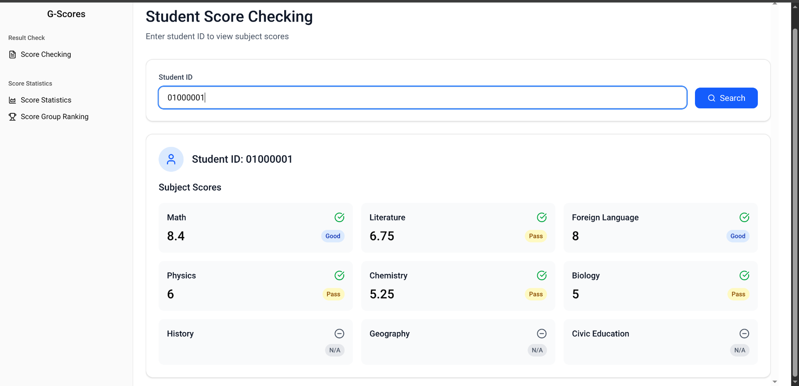
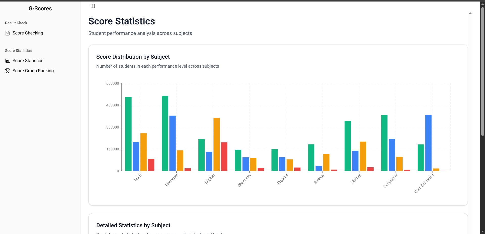
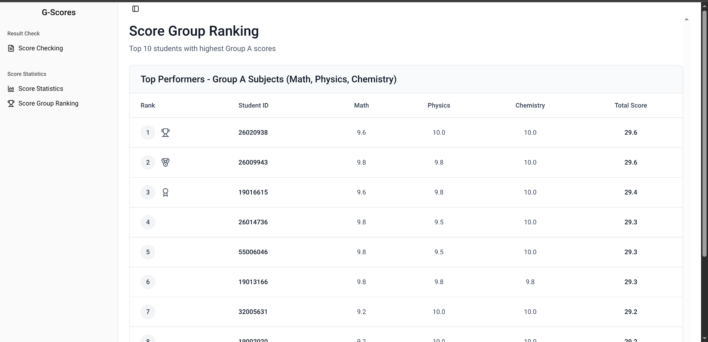

# G-Scores Frontend

The Frontend of G-Scores web app using React.

## How to install

Following these steps

```bash
# Clone the project
git clone https://github.com/thanhKasper/gscores-frontend.git

# At the directory where you clone the project
cd gscores-frontend

# Install all packages
yarn install

# Run the project
yarn dev
```

## Preview




